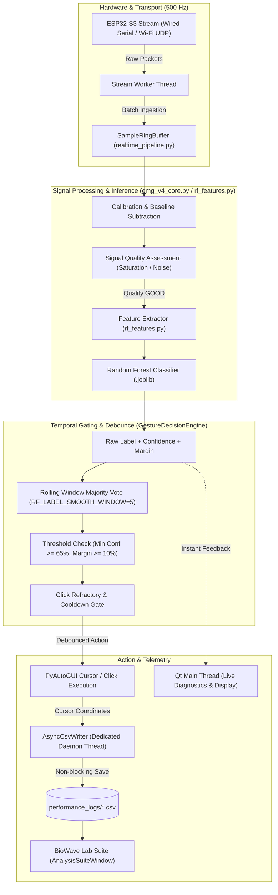

# BioWave Lab Suite & Adaptive Controller Architecture Reference

A comprehensive technical reference detailing the unified architecture, real-time temporal filtering, experimental protocols (ISO 9241-9 / ISO 9241-411), and modular consolidation of the BioWave EMG platform.

---

## Table of Contents

- [1. Executive Summary](#1-executive-summary)
- [2. System Architecture & Data Flow](#2-system-architecture--data-flow)
- [3. Codebase Evolution & File Consolidation](#3-codebase-evolution--file-consolidation)
  - [3.1 The 9-in-1 Lab Suite Merge](#31-the-9-in-1-lab-suite-merge)
  - [3.2 Controller Evolution: V2 $\rightarrow$ V3 $\rightarrow$ `mouse_controller.py`](#32-controller-evolution-v2-rightarrow-v3-rightarrow-mouse_controllerpy)
- [4. Real-Time Decision & Debounce Pipeline](#4-real-time-decision--debounce-pipeline)
  - [4.1 Problem: Misclassifications & Decision Boundary Jitter](#41-problem-misclassifications--decision-boundary-jitter)
  - [4.2 Majority-Vote Temporal Smoothing Buffer](#42-majority-vote-temporal-smoothing-buffer)
  - [4.3 Multi-Stage Gating Pipeline](#43-multi-stage-gating-pipeline)
  - [4.4 Latency vs. Stability Mathematical Trade-off](#44-latency-vs-stability-mathematical-trade-off)
- [5. Safety, Signal Quality, & Fault Recovery](#5-safety-signal-quality--fault-recovery)
- [6. BioWave Lab Suite (`biowave_lab_suite.py`) Modules](#6-biowave-lab-suite-biowave_lab_suitepy-modules)
  - [Tab 1: Experiment Manager](#tab-1-experiment-manager)
  - [Tab 2: ISO 9241-9 Task Launcher](#tab-2-iso-9241-9-task-launcher)
  - [Tab 3: Performance Analysis](#tab-3-performance-analysis)
  - [Tab 4: Publication Figures](#tab-4-publication-figures)
  - [Tab 5: Session Comparison & Cross-Study Aggregation](#tab-5-session-comparison--cross-study-aggregation)
- [7. ISO 9241-9 / ISO 9241-411 Research Framing](#7-iso-9241-9--iso-9241-411-research-framing)
- [8. Concurrency, UI Responsiveness & Thread Safety](#8-concurrency-ui-responsiveness--thread-safety)
- [9. File Inventory & Status Matrix](#9-file-inventory--status-matrix)
- [10. Setup, Permissions & Operating Guide](#10-setup-permissions--operating-guide)

---

## 1. Executive Summary

The BioWave EMG human-computer interface ecosystem has been unified from multiple disparate scripts into a decoupled, high-performance research platform.

```
┌─────────────────────────────────────────────────────────────────────────────────────────┐
│                                 BioWave Platform Architecture                           │
└─────────────────────────────────────────────────────────────────────────────────────────┘
                                       │
         ┌─────────────────────────────┴─────────────────────────────┐
         ▼                                                           ▼
┌─────────────────────────────────┐                         ┌─────────────────────────────────┐
│      mouse_controller.py        │  ◄── Live Controller ──►│     biowave_lab_suite.py        │
│   (Standalone EMG Controller)   │         Adapter         │   (ISO 9241-9 Lab & Analytics)  │
└─────────────────────────────────┘                         └─────────────────────────────────┘
         │                                                           │
         ├─► rf_features.py (Canonical Feature Extraction)           ├─► Experiment Manager Tab
         ├─► emg_v4_core.py (DSP, Filtering, Decision Engine)        ├─► ISO 9241-9 Task Tab
         └─► realtime_pipeline.py (Ring Buffer & Profiling)          ├─► Performance Analysis Tab
                                                                     ├─► Publication Figures Tab
                                                                     └─► Session Comparison Tab
```

### Key Engineering Highlights:
- **Zero GUI Lag via Asynchronous Execution**: Real-time packet acquisition, inference, and trajectory logging run decoupled from Qt rendering using lock-free ring buffers and dedicated `QThread` workers.
- **Debounced Action Execution**: Majority-vote temporal buffering and confidence-margin gating eliminate isolated misclassifications and decision-boundary flicker without degrading live operator UI feedback.
- **Rigorous Fitts' Law Evaluation**: Complete protocol implementation of ISO 9241-9 / ISO 9241-411 multidirectional tapping tasks with automated computation of throughput ($TP$), path efficiency ($PE$), overshoots, and movement time ($MT$).
- **Single-Entry Point Lab Suite**: Merged 9 fragmented logging, task, and plotting scripts into [biowave_lab_suite.py](file:///Users/shimulkumarshoishob/Documents/CAPSTON_PROJECT/BioWave-GUI/code/biowave_lab_suite.py).

---

## 2. System Architecture & Data Flow

The end-to-end signal processing and action pipeline flows through dedicated threads to guarantee timing determinism and UI responsiveness:



---

## 3. Codebase Evolution & File Consolidation

### 3.1 The 9-in-1 Lab Suite Merge

Previously, experimental management, logging, ISO task execution, analysis, and plotting were split across 9 separate scripts. These have been merged into [biowave_lab_suite.py](file:///Users/shimulkumarshoishob/Documents/CAPSTON_PROJECT/BioWave-GUI/code/biowave_lab_suite.py):

| Former Separate File | Merged Class / Function in `biowave_lab_suite.py` | Responsibility |
|---|---|---|
| `async_csv.py` | [`AsyncCsvWriter`](file:///Users/shimulkumarshoishob/Documents/CAPSTON_PROJECT/BioWave-GUI/code/biowave_lab_suite.py#L82-L141) | Non-blocking background CSV writing on a dedicated daemon thread. |
| `performance_logger.py` | [`PerformanceLogger`](file:///Users/shimulkumarshoishob/Documents/CAPSTON_PROJECT/BioWave-GUI/code/biowave_lab_suite.py#L151-L208), [`PerformanceTarget`](file:///Users/shimulkumarshoishob/Documents/CAPSTON_PROJECT/BioWave-GUI/code/biowave_lab_suite.py#L144-L149) | Trajectory, movement state, and click event telemetry logging. |
| `controller_adapters.py` | [`EmgControllerProtocol`](file:///Users/shimulkumarshoishob/Documents/CAPSTON_PROJECT/BioWave-GUI/code/biowave_lab_suite.py#L210-L218), [`ControllerSession`](file:///Users/shimulkumarshoishob/Documents/CAPSTON_PROJECT/BioWave-GUI/code/biowave_lab_suite.py#L230-L286) | Standardized interface for Standard Mouse, EMG, Fixed-Step, and Adaptive controllers. |
| `iso_9241_9_task.py` | [`Iso92419TappingTask`](file:///Users/shimulkumarshoishob/Documents/CAPSTON_PROJECT/BioWave-GUI/code/biowave_lab_suite.py#L322-L625) | Interactive 2D multidirectional discrete tapping task widget. |
| `performance_analysis.py` | [`analyze_logs()`](file:///Users/shimulkumarshoishob/Documents/CAPSTON_PROJECT/BioWave-GUI/code/biowave_lab_suite.py#L627-L730), [`_trajectory_metrics()`](file:///Users/shimulkumarshoishob/Documents/CAPSTON_PROJECT/BioWave-GUI/code/biowave_lab_suite.py#L580-L625) | Mathematical parsing of Fitts' Law parameters ($TP, ID_e, PE, MT$). |
| `publication_figures.py` & `performance_figures.py` | [`save_figure()`](file:///Users/shimulkumarshoishob/Documents/CAPSTON_PROJECT/BioWave-GUI/code/biowave_lab_suite.py#L765-L910), [`FiguresTab`](file:///Users/shimulkumarshoishob/Documents/CAPSTON_PROJECT/BioWave-GUI/code/biowave_lab_suite.py#L1081-L1255) | Publication-grade Matplotlib figure rendering (PNG + vector PDF). |
| `experiment_manager.py` | [`ExperimentManagerTab`](file:///Users/shimulkumarshoishob/Documents/CAPSTON_PROJECT/BioWave-GUI/code/biowave_lab_suite.py#L1362-L1532) | Multi-condition test orchestration, block progression, and automated results saving. |
| `data_tools_ui.py` | [`ComparisonTab`](file:///Users/shimulkumarshoishob/Documents/CAPSTON_PROJECT/BioWave-GUI/code/biowave_lab_suite.py#L1257-L1360), [`TaskLauncherTab`](file:///Users/shimulkumarshoishob/Documents/CAPSTON_PROJECT/BioWave-GUI/code/biowave_lab_suite.py#L1534-L1613) | Unified UI container tabs and session aggregation viewers. |

> [!IMPORTANT]
> The legacy 9 standalone files listed above are superseded by `biowave_lab_suite.py`. All imports across the repository now target `biowave_lab_suite`.

---

### 3.2 Controller Evolution: V2 $\rightarrow$ V3 $\rightarrow$ `mouse_controller.py`

The standalone EMG mouse controller evolved through three iterations:

1. **`Mouse_wireless_v2.py` (Legacy Baseline)**:
   - Direct sample-to-action execution.
   - Windows-only styling (`Segoe UI`, Win32 API calls).
   - Fixed window sizes susceptible to UI clipping on macOS/Retina displays.
2. **`Mouse_wireless_standalone_v3.py` (Intermediate Release)**:
   - Introduced the majority-vote smoothing buffer.
   - Cross-platform dynamic theme integration (`app_theme.py`).
   - Resizable `QScrollArea` container to prevent off-screen clipping.
   - Direct wiring to `AnalysisSuiteWindow`.
3. **[mouse_controller.py](file:///Users/shimulkumarshoishob/Documents/CAPSTON_PROJECT/BioWave-GUI/code/mouse_controller.py) (Canonical Active Controller)**:
   - Canonical single entry-point for all wired (USB/Serial) and wireless (Wi-Fi UDP) mouse control.
   - Decoupled from `main.py` (no heavy recording/training overhead).
   - Integrated with [`GestureDecisionEngine`](file:///Users/shimulkumarshoishob/Documents/CAPSTON_PROJECT/BioWave-GUI/code/emg_v4_core.py#L265-L298), [`SignalQuality`](file:///Users/shimulkumarshoishob/Documents/CAPSTON_PROJECT/BioWave-GUI/code/emg_v4_core.py#L194-L215), and model validation guards.

---

## 4. Real-Time Decision & Debounce Pipeline

### 4.1 Problem: Misclassifications & Decision Boundary Jitter

EMG signals exhibit stochastic variations, baseline drift, and transient motion artifacts. In raw per-window inference pipelines:
- **Isolated False Triggers**: A single noisy window can momentarily cross a decision boundary and trigger an unwanted click or erratic cursor jump.
- **Boundary Jitter**: When muscle contraction hover near two gesture profiles (e.g., *Wrist Extension* vs. *Hand Open*), the classifier rapidly alternates between labels, causing cursor stutter.

### 4.2 Majority-Vote Temporal Smoothing Buffer

To solve this without sacrificing live operator visibility, a dual-path architecture was implemented:

1. **Immediate Visual Path**:
   Every raw prediction is instantly updated on the GUI (`lbl_prediction`, `lbl_conf`). The operator observes the raw classifier output with zero added delay.
2. **Temporal Debounced Action Path**:
   Actions are gated through a rolling window buffer in [`GestureDecisionEngine`](file:///Users/shimulkumarshoishob/Documents/CAPSTON_PROJECT/BioWave-GUI/code/emg_v4_core.py#L265-L298).

```python
# Configuration constants in mouse_controller.py & emg_v4_core.py
RF_LABEL_SMOOTH_WINDOW = 5          # Number of historical prediction windows
CONSECUTIVE_REQUIRED = 3            # Minimum agreement (60% quorum)
GESTURE_MIN_CONFIDENCE_DEFAULT = 0.65  # Minimum classification confidence (65%)
GESTURE_MIN_MARGIN_DEFAULT = 0.10      # Minimum margin between top-1 and top-2
CLICK_REFRACTORY_S = 0.8               # Click cooldown period
```

### 4.3 Multi-Stage Gating Pipeline

For an action to be emitted by `on_prediction_ready()`:

```
[Raw Window (200ms)] ──► [Feature Extraction (rf_features.py)] ──► [RF Model Probabilities]
                                                                          │
 ┌────────────────────────────────────────────────────────────────────────┘
 ▼
[Stage 1: Signal Quality Check]   ──► Reject if SATURATED, DEAD, or NOISY
 ▼
[Stage 2: Confidence & Margin]    ──► Reject if Conf < 65% or Margin < 10%
 ▼
[Stage 3: Rolling Buffer Vote]    ──► Reject if Agreement < 3 of 5 windows
 ▼
[Stage 4: State Machine Match]    ──► GESTURE_ACTIVE (initial) / GESTURE_HELD (sustained)
 ▼
[Stage 5: Refractory Gating]      ──► Suppress if Click interval < refractory_s
 ▼
[Execution: pyautogui]            ──► Move cursor or trigger click
```

#### Calibration & Model Boundary Safety:
Whenever a REST/FLEX calibration routine completes or a new `.joblib` model artifact is loaded, the decision engine's history buffer is explicitly cleared (`self.decision_engine.history.clear()`). This prevents stale pre-calibration states from contaminating current votes.

### 4.4 Latency vs. Stability Mathematical Trade-off

The system parameters introduce a deterministic, predictable latency trade-off:

$$\text{Onset Latency} = (K - 1) \times \text{Stride Duration}$$

Given standard acquisition parameters:
- **Sampling Rate ($f_s$)**: $500\text{ Hz}$
- **Window Length ($W$)**: $100\text{ samples}\ (200\text{ ms})$
- **Inference Stride ($S$)**: $25\text{ samples}\ (50\text{ ms})$
- **Agreement Threshold ($K$)**: $3\text{ consecutive windows}$

$$\text{Onset Latency} = (3 - 1) \times 50\text{ ms} = 100\text{ ms}$$
$$\text{Worst-Case Buffer Fill} = (5 - 1) \times 50\text{ ms} = 200\text{ ms}$$

> [!NOTE]
> Once a gesture is active and held, actions fire on every stride interval ($50\text{ ms} = 20\text{ Hz}$ control loop) with zero additional latency. The $100\text{--}200\text{ ms}$ debounce applies only to initial gesture onset.

---

## 5. Safety, Signal Quality, & Fault Recovery

The controller implements multi-layered safety mechanisms to protect the operator and host operating system:

```
┌─────────────────────────────────────────────────────────────────────────────────┐
│                           Controller Fault Tree & Failsafes                     │
├───────────────────────────────┬──────────────────────────┬──────────────────────┤
│ Fault Condition               │ Detection Point          │ Automated Action     │
├───────────────────────────────┼──────────────────────────┼──────────────────────┤
│ Electrode Detachment / Sat    │ assess_signal_quality()  │ Invalidate window    │
│ Baseline Voltage Drift        │ RealTimePreprocessor     │ Auto-drift baseline  │
│ Wireless UDP Packet Gap > 1   │ WirelessStats.observe()  │ Invalidate window    │
│ Classifier Exception / NaN    │ on_inference_error()     │ Disable mouse toggle │
│ PyAutoGUI Screen Corner Slam  │ pyautogui.FAILSAFE = True│ Immediate abort      │
└───────────────────────────────┴──────────────────────────┴──────────────────────┘
```

- **Single Fail-Safe Method**: All link dropouts, packet corruption, calibration loss, and user disable events funnel through `disable_mouse_control(reason)`. This guarantees that cursor control cannot get stuck in an active state.

---

## 6. BioWave Lab Suite (`biowave_lab_suite.py`) Modules

The Lab Suite is structured into 5 dedicated tabs, accessible standalone or via the **"Open Lab Suite"** button in `mouse_controller.py`:

```
┌─────────────────────────────────────────────────────────────────────────────────┐
│ BioWave Lab Suite - AnalysisSuiteWindow                                         │
├───────────────────┬──────────────┬──────────────┬──────────────┬────────────────┤
│ 1. Exp Manager    │ 2. ISO Task  │ 3. Analysis  │ 4. Figures   │ 5. Comparison  │
└───────────────────┴──────────────┴──────────────┴──────────────┴────────────────┘
```

### Tab 1: Experiment Manager
- Manages standardized, multi-block experimental protocols across 4 controller conditions:
  1. `Standard mouse` (Baseline hardware mouse)
  2. `EMG mouse` (Live BioWave gesture control)
  3. `Fixed-step controller` (Discrete stepping controller)
  4. `Improved controller` (Adaptive dynamic gain controller)
- Automates session directories (`experiment_results/participant_X/`), block tracking, and participant metadata logging.

### Tab 2: ISO 9241-9 Task Launcher
- Standalone runner for the ISO 9241-9 multidirectional discrete tapping task.
- Configurable target circle layout:
  - **Number of Targets ($N$)**: 13 or 17 targets arranged in a circle.
  - **Difficulty Levels**:
    - *Easy*: Diameter $D = 400\text{ px}$, Width $W = 80\text{ px}$ ($ID = 2.58\text{ bits}$)
    - *Medium*: Diameter $D = 550\text{ px}$, Width $W = 55\text{ px}$ ($ID = 3.46\text{ bits}$)
    - *Hard*: Diameter $D = 700\text{ px}$, Width $W = 35\text{ px}$ ($ID = 4.39\text{ bits}$)
- Real-time hit, miss, and target progression tracking.

### Tab 3: Performance Analysis
- Background analysis worker parsing raw `iso9241_9_trials.csv` and `performance_trials.csv`.
- Computes standardized Fitts' law metrics:
  - **Effective Index of Difficulty ($ID_e$)**:
    $$ID_e = \log_2\left(\frac{D_e}{W_e} + 1\right)$$
  - **Throughput ($TP$)**:
    $$TP = \frac{ID_e}{MT} \quad (\text{bits/s})$$
  - **Path Efficiency ($PE$)**:
    $$PE = \frac{\text{Straight-line Distance}}{\text{Actual Trajectory Length}} \times 100\%$$
  - **Overshoots & Direction Reversals**: Trajectory deviation and correction counts.
  - **Time to First Movement**: Human reaction time before trajectory initiation.
- One-click export to `analysis.csv`.

### Tab 4: Publication Figures
- Live Qt-embedded Matplotlib viewer generating 7 standard publication figures:

| Figure Key | Plot Type | Metric / Description |
|---|---|---|
| `fitts_law` | Scatter + Linear Regression | Movement Time vs. Effective Index of Difficulty ($MT = a + b \cdot ID_e$) |
| `throughput` | Bar Chart | Mean Throughput per Participant ($TP$ in bits/s) |
| `path_efficiency` | Bar Chart | Mean Path Efficiency (%) |
| `overshoots` | Bar Chart (Sum) | Total Cursor Overshoots per Participant |
| `click_error_rate` | Bar Chart | Missed Clicks / Total Attempts Ratio |
| `fatigue` | Scatter + Rolling Mean | Movement Time Across Sequential Trials (Fatigue Tracking) |
| `boxplots` | 4-Panel Boxplot Grid | Distributions of MT, Throughput, Path Efficiency, and Overshoots |

- Export options: Single figure or all figures simultaneously in high-resolution PNG ($300\text{ DPI}$) and vector PDF format.

### Tab 5: Session Comparison & Cross-Study Aggregation
- Automated recursive scanner across `experiment_results/` or custom session folders.
- Compiles three real-time aggregated comparison tables:
  1. **By-Session**: Individual block-level breakdown.
  2. **By-Participant**: Means and standard deviations grouped per participant.
  3. **Overall**: Macro-level summary across all controller conditions.
- Direct table view in `QTableWidget` with individual CSV export capabilities.

---

## 7. ISO 9241-9 / ISO 9241-411 Research Framing

> [!IMPORTANT]
> **Understanding Protocol Conformance vs. Certification**:
>
> The BioWave Lab Suite implements the mathematical and experimental **protocol** defined in ISO 9241-9 (and its successor ISO 9241-411) for non-keyboard input devices.
>
> - **What this software provides**: Exact conformance to the multidirectional tapping task geometry, randomized target ordering, effective target width calculation ($W_e = 4.133 \times \sigma$), and throughput formulation.
> - **What this software does NOT grant**: Institutional "ISO Certification". Certification is an audit of an organization's experimental procedures, subject recruitment, and laboratory environment, not a property of a software script.
> - **Recommended Publication Usage**: State that *"Evaluation was conducted using a multidirectional tapping task conforming to the ISO 9241-9 / ISO 9241-411 evaluation protocol."*

---

## 8. Concurrency, UI Responsiveness & Thread Safety

To prevent cursor hitching, frame drops, or frozen windows during intensive computation:

```mermaid
graph LR
    subgraph UIThread ["Main Thread (Qt GUI)"]
        UIWindow["AnalysisSuiteWindow / Mouse Controller"]
        Canvas["FigureCanvasQTAgg (Matplotlib)"]
        Scroll["QScrollArea (Dynamic Reflow)"]
    end

    subgraph DataThread ["Async CSV Worker (Daemon Thread)"]
        Queue["queue.Queue(maxsize=256)"]
        Writer["AsyncCsvWriter._run()"]
        Queue --> Writer
    end

    subgraph AnalysisThread ["Background Compute (QThread)"]
        Job["BackgroundJob"]
        PandasEngine["Pandas / NumPy Metric Engine"]
        Job --> PandasEngine
    end

    UIWindow -->|submit(records)| Queue
    UIWindow -->|Trigger Analysis| Job
    PandasEngine -->|pyqtSignal(job_finished)| UIWindow
    UIWindow -->|Update Data| Canvas
```

1. **Dedicated I/O Thread (`AsyncCsvWriter`)**:
   Cursor positions are sampled at up to $500\text{ Hz}$. Telemetry records are pushed to an in-memory queue (`put_nowait`). Disk writes occur asynchronously on a daemon thread. If disk I/O stalls, telemetry drops gracefully rather than blocking cursor movement.
2. **Background Compute Worker (`BackgroundJob`)**:
   CSV parsing, trajectory grouping, and metric aggregation execute on a dedicated `QThread`. Qt signals (`job_finished`, `job_failed`) safely notify the GUI upon completion.
3. **Main-Thread Painting Safety**:
   Qt requires all widget and canvas painting to occur on the main thread. Matplotlib figures are created and drawn exclusively in the GUI thread after background calculations finish.
4. **macOS Display & DPI Scaling**:
   All tabs are encased in a `QScrollArea` with `setWidgetResizable(True)`. Dynamic font resolution is managed through [app_theme.py](file:///Users/shimulkumarshoishob/Documents/CAPSTON_PROJECT/BioWave-GUI/code/app_theme.py), preventing UI clipping across varying MacBook display scalings.

---

## 9. File Inventory & Status Matrix

```
code/
├── mouse_controller.py          # CANONICAL standalone mouse controller
├── biowave_lab_suite.py         # CANONICAL merged lab suite, ISO task & analytics
├── emg_v4_core.py               # Core DSP, filtering, signal quality & decision engine
├── rf_features.py               # Feature extraction (shared with main.py trainer)
├── realtime_pipeline.py         # Thread-safe sample ring buffer
├── app_theme.py                 # Cross-platform styles, fonts, and dark mode palette
├── main.py                      # Full data acquisition, plotting, & model training app
├── emg_simulator_app.py         # Standalone synthetic signal generator
└── LAB_SUITE_CHANGES.md         # Technical architecture & changelog (this file)
```

| File Name | Role / Status | Notes |
|---|---|---|
| [mouse_controller.py](file:///Users/shimulkumarshoishob/Documents/CAPSTON_PROJECT/BioWave-GUI/code/mouse_controller.py) | **Active (Primary)** | Replaces `Mouse_wireless_v2.py` and `Mouse_wireless_standalone_v3.py`. |
| [biowave_lab_suite.py](file:///Users/shimulkumarshoishob/Documents/CAPSTON_PROJECT/BioWave-GUI/code/biowave_lab_suite.py) | **Active (Primary)** | Replaces the 9 legacy logging/analysis scripts. |
| [emg_v4_core.py](file:///Users/shimulkumarshoishob/Documents/CAPSTON_PROJECT/BioWave-GUI/code/emg_v4_core.py) | **Active (Core)** | GUI-independent decision engine and signal quality validator. |
| [rf_features.py](file:///Users/shimulkumarshoishob/Documents/CAPSTON_PROJECT/BioWave-GUI/code/rf_features.py) | **Active (Core)** | Canonical feature set (MAV, RMS, WL, ZC, SSC, SampEn, cross-channel). |
| [realtime_pipeline.py](file:///Users/shimulkumarshoishob/Documents/CAPSTON_PROJECT/BioWave-GUI/code/realtime_pipeline.py) | **Active (Core)** | High-throughput circular ring buffer for sliding window extraction. |
| [app_theme.py](file:///Users/shimulkumarshoishob/Documents/CAPSTON_PROJECT/BioWave-GUI/code/app_theme.py) | **Active (Theme)** | System-native font selection and cross-platform UI theming. |
| [main.py](file:///Users/shimulkumarshoishob/Documents/CAPSTON_PROJECT/BioWave-GUI/code/main.py) | **Active (Standalone)** | Multi-channel data collection, visualizer, and RF model trainer. |
| [emg_simulator_app.py](file:///Users/shimulkumarshoishob/Documents/CAPSTON_PROJECT/BioWave-GUI/code/emg_simulator_app.py) | **Active (Utility)** | Virtual synthetic EMG generator for hardware-free testing. |

---

## 10. Setup, Permissions & Operating Guide

### Prerequisites & Dependencies
Install the required scientific, GUI, and hardware control packages:

```bash
python3 -m pip install PyQt5 numpy pandas matplotlib joblib pyserial pyautogui
```

### macOS Accessibility Permission Setup
On macOS, `pyautogui` requires OS-level Accessibility permissions to move the cursor and simulate mouse clicks.

> [!CAUTION]
> If Accessibility permissions are not granted, the cursor will not move, and `pyautogui` may raise a silent permission exception.
>
> 1. Open **System Settings** $\rightarrow$ **Privacy & Security** $\rightarrow$ **Accessibility**.
> 2. Enable your terminal application (e.g., *Terminal*, *iTerm2*, or *VS Code* / *IDE*).
> 3. Restart the terminal / IDE after modifying permissions.

---

### Launching Applications

#### 1. Launch the Standalone Mouse Controller:
```bash
python3 code/mouse_controller.py
```
- Select **Wired (Serial)** or **Wireless (Wi-Fi UDP)** mode.
- Load your trained model artifact (`.joblib`).
- Perform the 3-second REST / 3-second FLEX calibration.
- Toggle **ENABLE MOUSE CONTROL**.
- Click **Open Lab Suite** to open the experiment suite while maintaining live connection.

#### 2. Launch the BioWave Lab Suite Standalone:
```bash
python3 code/biowave_lab_suite.py
```
- Run ISO 9241-9 experiments.
- Analyze log directories and compute Fitts' law metrics.
- Generate and export publication figures.
- Compare multi-session results.
